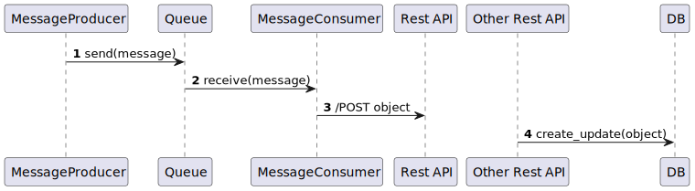

# 2. using publisher subscriber pattern

Date: 2024-05-12

## Status

Accepted

## Context

The issue motivating this decision, and any context that influences or constrains the decision.

## Decision

The change that we're proposing or have agreed to implement.

## Consequences

What becomes easier or more difficult to do and any risks introduced by the change that will need to be mitigated.

Supporting diagrams:

    @startuml img/PublisherDiagram

    autonumber
    Queue -> Service : receive(message)
    Service -> "Rest API": /POST object
    "Rest API" -> DB: create_update(object)

    @enduml

    @startuml img/SubscriberDiagram

    autonumber
    Queue -> Service : receive(message)
    Service -> "Rest API": /POST object
    "Rest API" -> DB: create_update(object)

    @enduml

    @startuml img/PublisherSubscriberDiagram

    autonumber
    
    Client -> "Rest API": /POST object
    "Rest API" -> MessageProducer: create_update(object)
    MessageProducer -> Queue : send(message)
    Queue -> MessageConsumer : receive(message)
    MessageConsumer -> "Other Rest API": /POST object
    "Other Rest API" -> DB: create_update(object)

    @enduml

